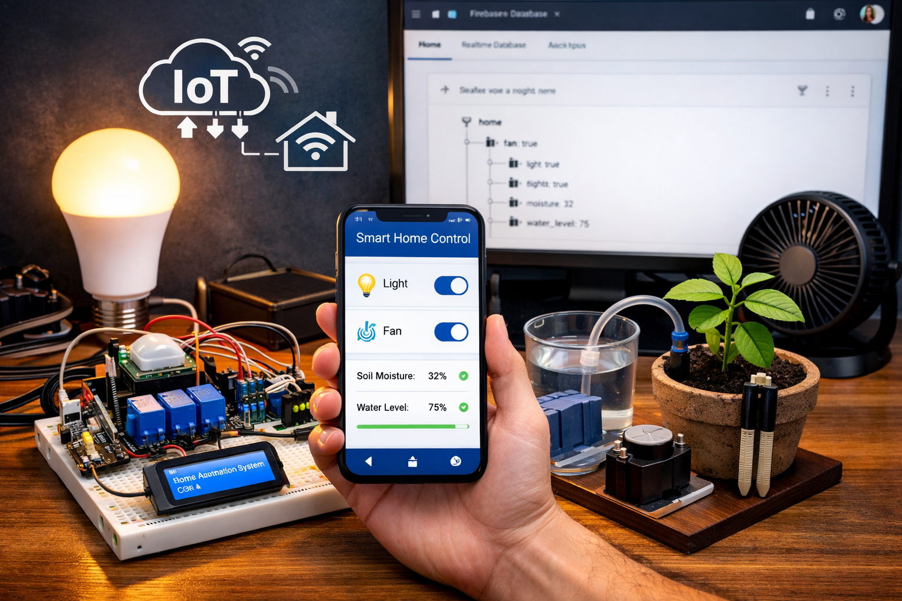

# 🏠 IoT Based Home Automation System

An **IoT-enabled Home Automation System** designed to remotely monitor and control household appliances using **ESP32 microcontrollers**, a **Flutter-based Android application**, and **Firebase Realtime Database**. The system provides real-time appliance control, sensor monitoring, and a scalable master–slave device architecture.

## 📌 Project Overview

This project implements a centralized IoT-based Home Automation System (HMS that allows users to control and monitor home appliances from anywhere in the world using a mobile application and an active internet connection. The system emphasizes **convenience, energy efficiency, scalability, and assistive usability**.

The architecture uses **two ESP32 boards**:
- **Master ESP32** – Controls lights and fans and communicates with Firebase
- **Slave ESP32** – Manages water pump control and plant moisture monitoring
All user commands are issued through a Flutter mobile app and synchronized in real time via Firebase.

## 🎯 Objectives

- Enable remote control of household appliances  
- Provide real-time synchronization between devices and mobile app  
- Monitor environmental parameters such as plant moisture  
- Design a scalable and modular IoT automation system  
- Improve accessibility through mobile-based control  

## ⚙️ System Architecture

**User → Flutter App → Firebase Realtime Database → ESP32 Master → ESP32 Slave → Appliances & Sensors**

- User interacts with the system via Android application  
- Firebase acts as a real-time cloud communication layer  
- ESP32 boards fetch and update device states continuously  

## 🧠 Key Features

- 📱 Android app built using **Flutter**
- ☁️ Real-time cloud synchronization using **Firebase**
- 🔌 Control of lights, fan, and water pump
- 🌱 Plant moisture monitoring with automated pump control
- 🔁 Master–Slave ESP32 communication
- 🌍 Remote access from anywhere with internet connectivity

## 🛠️ Hardware Components

- ESP32 (2 units – Master & Slave)
- Relay Module
- PIR Sensor
- Ultrasonic Sensor
- Temperature Sensor
- Soil Moisture Sensor
- Solenoid Valve / Water Pump
- Power Supply and connecting wires

## 💻 Software & Technologies Used

- ESP32 Arduino Core
- Arduino IDE
- Flutter (Dart)
- Firebase Realtime Database
- Visual Studio Code (VS Code)

